```python
import stomatadetector as sd
%matplotlib inline
```

## 1. Load FLEX files 
### 1.1 Select the folder containing the FLEX files you want to analyse

The first step is to point the notebook at the list of files you want to use. The chooser buttons below will let you pick the folder full of FLEX files. You won't see the FLEX files at this stage. Run the cell below to start..


```python
f = sd.FileBrowser()
f.widget()
```

### 1.2 Load and check the file list
Run this cell to load the list of files into memory, the list will print below.


```python
flex_file_names = sd.GetFlexList(f.path)
flex_file_names
```


    ['/Users/macleand/Desktop/stomata_detector/ipynbs_and_test_data/test_data/multi/002002002.flex',
     '/Users/macleand/Desktop/stomata_detector/ipynbs_and_test_data/test_data/multi/002004004.flex',
     '/Users/macleand/Desktop/stomata_detector/ipynbs_and_test_data/test_data/multi/006003001.flex',
     '/Users/macleand/Desktop/stomata_detector/ipynbs_and_test_data/test_data/multi/007008004.flex']


## 2. Run an analysis

All analysis is done in a single step with `sd.GetStomataObjects` which just needs a list of FLEX file names to work and returns a load of objects that represent the analysed leaf image. Running the code below does the analysis and will print out some meta information on the files, including Treatment, Well Coords, Time, Pixel Info and Stack.


```python
analysed_flex_files = sd.GetStomataObjects(flex_file_names)

for f in analysed_flex_files:
    print(f.sample_info() )
    
```

    /Users/macleand/anaconda/lib/python3.5/site-packages/tifffile/tifffile.py:1974: UserWarning: tags are not ordered by code
      warnings.warn("tags are not ordered by code")


    ['CW01', '2', '2', '2015-05-21T11:41:59Z', 'm', '6.459e-007', 'm', '6.459e-007', '2']
    ['CW05', '2', '4', '2015-05-21T11:43:27Z', 'm', '6.459e-007', 'm', '6.459e-007', '4']
    ['CW04', '6', '3', '2015-05-21T10:18:26Z', 'm', '6.459e-007', 'm', '6.459e-007', '1']
    ['CW15', '7', '8', '2015-05-21T10:25:47Z', 'm', '6.459e-007', 'm', '6.459e-007', '4']


### 2.1 Inspect properties of the images

You can preview the maximum projection of the image and see a histogram of pixel intensities with the `sd.stomataobjects.imshow` and `sd.stomataobjects.imhist` functions. We go over them one at a time with the `for` loop. We'll also show the max and min pixel values of the maximum projection.


```python

analysed_flex_files = sd.GetStomataObjects(flex_file_names)

for flex in analysed_flex_files:
    sd.stomataobjects.imshow(flex.mp, width=8, height=6, title=flex.flex_file)
    print(flex.mp.min(), flex.mp.max())
    sd.stomataobjects.imhist(flex, bins=50)
    
    
```

    /Users/macleand/anaconda/lib/python3.5/site-packages/tifffile/tifffile.py:1974: UserWarning: tags are not ordered by code
      warnings.warn("tags are not ordered by code")


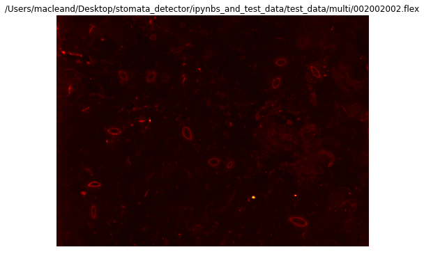


    11 511


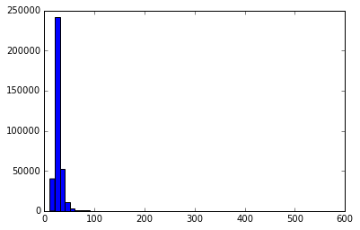


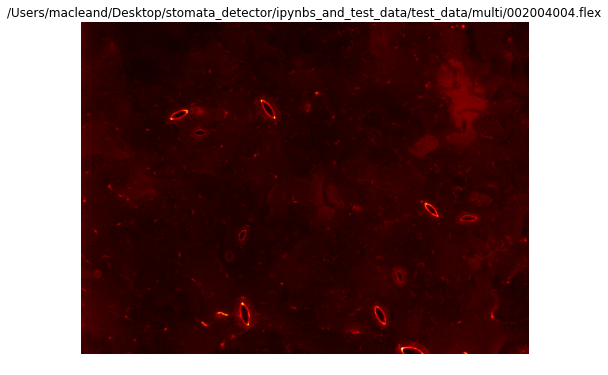


    11 306


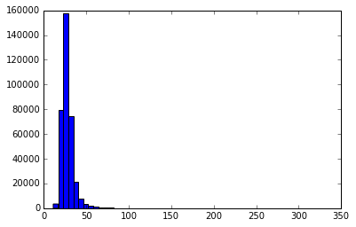


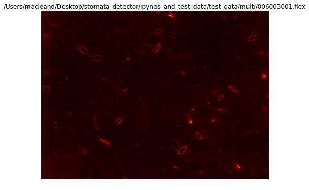


    12 471


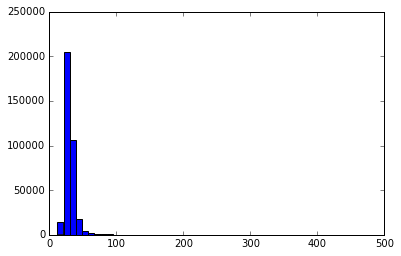


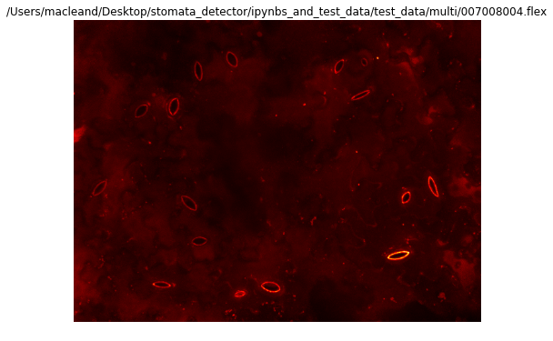


    23 615


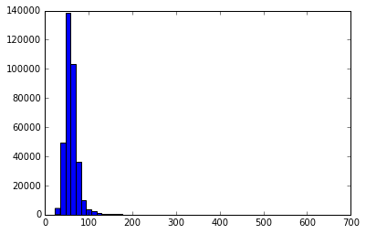


## 2.2 Apply image processing steps

Now we've seen the histograms, we can tell the pixel values for the images go up to 100 and not below 50 in the first three flex files, so lets clip everything under 50 to black and above 100 to 65535 (the max for the image type) so we get good clear intensity values.

The `sd.GetStomataObjects` allows you to pass image manipulation parameters (think of these like Photoshop filters) using a list of options. Below you can see all the image options. Those beginning with `#` won't be applied.

## 2.2.1 Apply pore finding parameters

Pore finding is done at the same time as stomata finding, so if you want to set up options for that you should do it when calling `sd.GetStomataObjects`. You can pass the options for pore finding in the same way as for image processing. No segment options are set by default. 


```python
image_options = [
   # ('gamma',1.25),
    #('median', 2),
    #('gaussian', 1),
    #('rescale', None),
    #('sharpen', 3),
    #('log', 3),
    #('adaptive', 1),
    ('clip', (50,100))
          
          ]

segment_options = [
    ('pore_percentile', 75),
    ('pore_edge_object_margin', 1),
    ('stomate_max_obj_size', 1000),
    ('stomate_min_obj_size',200)
]

analysed_flex_files = sd.GetStomataObjects(flex_file_names, image_options=options, segment_options=segment_options)
for flex in analysed_flex_files:
    sd.stomataobjects.imshow(flex.mp, width=8, height=6, title=flex.flex_file)
    print(flex.mp.min(), flex.mp.max())
    sd.stomataobjects.imhist(flex, bins=50)

```

    /Users/macleand/anaconda/lib/python3.5/site-packages/tifffile/tifffile.py:1974: UserWarning: tags are not ordered by code
      warnings.warn("tags are not ordered by code")


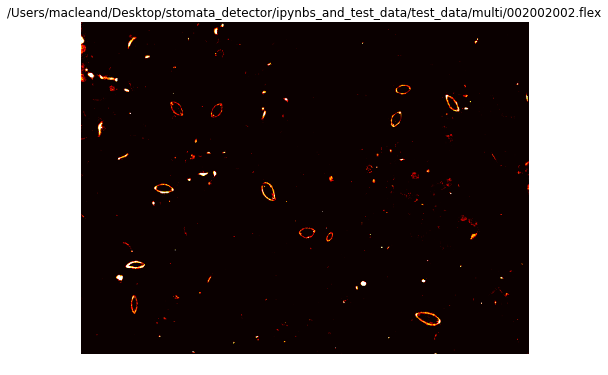


    0 65535


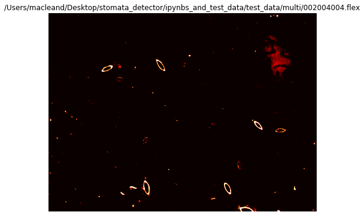


    0 65535


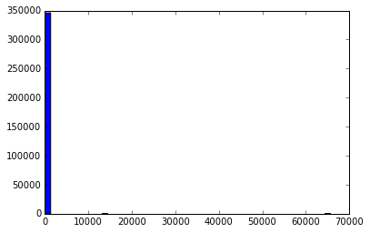


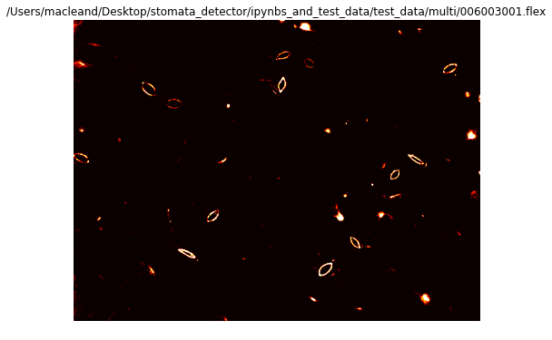


    0 65535


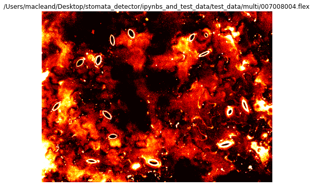


    0 65535


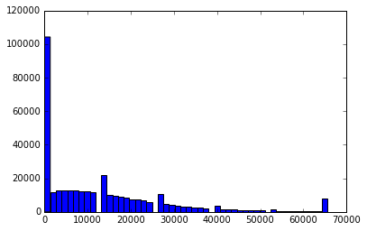


## 3 Work with objects

### 3.1 Preview rough objects

So for 3 of the 4 images we have clean images. The `sd.GetStomataObjects` function always gets the stomata objects anyway so lets look at the raw stomata. We'll print the simple binary object image, the count of objects and the labelled object image.


```python
for flex in analysed_flex_files:
    sd.stomataobjects.imshow(flex.binary_obj_img, width=4, height=3, title=flex.flex_file)
    print(flex.object_count() )
    sd.stomataobjects.imshow(flex.stomata_labels, width=4, height=3)
```


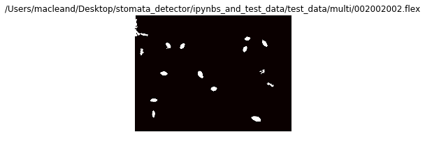


    16


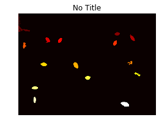


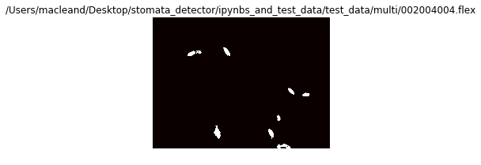


    9


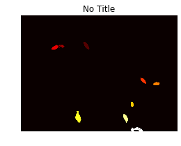


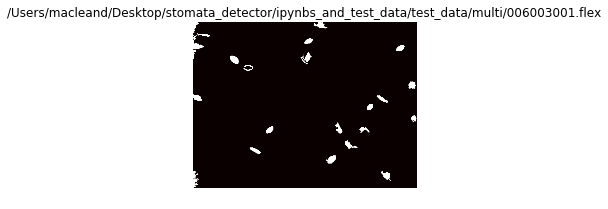


    21


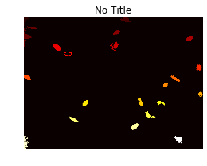


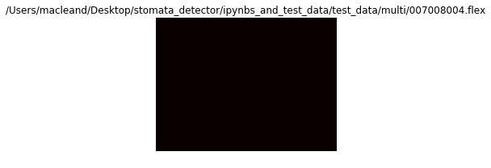


    0


### 3.2 Filter objects

Now we can filter objects based on their properties. This is done with the `sd.stomataobjects.object_filter` function. Again, we do this with a list of options


```python
obj_filter = [
        ('delete_border_objects', True),
        ('max_area', 1000),
        ('min_area', 200),
        ('roundness', 0.65),
        ('width_length', 3)
    
]

for flex in analysed_flex_files:
    sd.stomataobjects.object_filter(flex, obj_filter)
    sd.stomataobjects.imshow(flex.stomata_labels, width=4, height=3)
    sd.stomataobjects.imshow(flex.binary_obj_img, width=4, height=3)

```


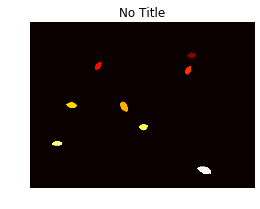


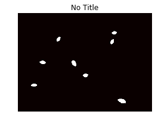


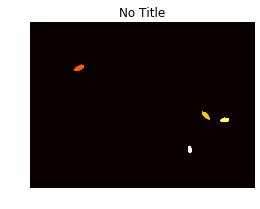


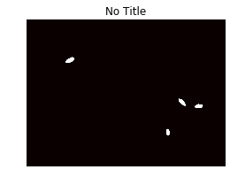


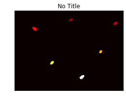


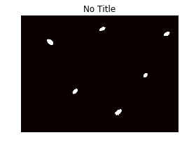


## 4. Outputting stomata information
So we get good clean objects. Each object knows stuff about itself so we can produce stomate level reports once we're happy. 

You can use a ```print(sd.stomataobjects.report_header() )``` to get the following header


```Treatment,PlateRow,PlateColumn,TimeStamp,XUnits,XUnitsPerPixel,YUnits,YUnitsPerPixel,Stack, CameraBinninX, CameraBinningY,ObjectCount,ImageStomateIndex,StomateArea,StomateRoundness,StomateLength,StomateWidth,PoreLength,PoreWidth```

And loop over the objects calling the report method to get the info.


```python
for flex in analysed_flex_files:
    for s in flex.stomata_objects:
        print(sd.stomataobjects.custom_report(flex,s))
```

    CW01,2,2,2015-05-21T11:41:59Z,m,6.459e-007,m,6.459e-007,2,8,3,333,0.878622735984,25.526153878995054,16.730170080075933
    CW01,2,2,2015-05-21T11:41:59Z,m,6.459e-007,m,6.459e-007,2,8,6,366,0.817386049289,28.113024211314134,16.68293069937815
    CW01,2,2,2015-05-21T11:41:59Z,m,6.459e-007,m,6.459e-007,2,8,7,368,0.821852639722,27.851364744578866,16.99907474999514
    CW01,2,2,2015-05-21T11:41:59Z,m,6.459e-007,m,6.459e-007,2,8,10,547,0.85163147791,34.139845569945315,20.522297963398387
    CW01,2,2,2015-05-21T11:41:59Z,m,6.459e-007,m,6.459e-007,2,8,11,426,0.799248144896,31.400750341919416,17.391351281403548
    CW01,2,2,2015-05-21T11:41:59Z,m,6.459e-007,m,6.459e-007,2,8,13,391,0.867596551779,26.53348075912059,18.921040048793575
    CW01,2,2,2015-05-21T11:41:59Z,m,6.459e-007,m,6.459e-007,2,8,14,364,0.748304012102,31.793770424529086,14.766995101241875
    CW01,2,2,2015-05-21T11:41:59Z,m,6.459e-007,m,6.459e-007,2,8,16,720,0.700620578058,42.99602787949478,21.569441693765846
    CW05,2,4,2015-05-21T11:43:27Z,m,6.459e-007,m,6.459e-007,4,4,3,397,0.715572577902,33.93327058787193,14.974908490967236
    CW05,2,4,2015-05-21T11:43:27Z,m,6.459e-007,m,6.459e-007,4,4,4,354,0.665798225523,33.12341136841591,13.83201594572904
    CW05,2,4,2015-05-21T11:43:27Z,m,6.459e-007,m,6.459e-007,4,4,5,306,0.668540214085,28.90525316201829,13.75666662276409
    CW05,2,4,2015-05-21T11:43:27Z,m,6.459e-007,m,6.459e-007,4,4,6,239,0.78279777065,23.771740052349973,13.177228123093371
    CW04,6,3,2015-05-21T10:18:26Z,m,6.459e-007,m,6.459e-007,1,6,4,315,0.777441052334,28.224018950718538,14.338497458643365
    CW04,6,3,2015-05-21T10:18:26Z,m,6.459e-007,m,6.459e-007,1,6,5,370,0.826319230156,28.51548727947008,16.632887036240177
    CW04,6,3,2015-05-21T10:18:26Z,m,6.459e-007,m,6.459e-007,1,6,7,491,0.795251662549,31.840357689024806,19.71073142553495
    CW04,6,3,2015-05-21T10:18:26Z,m,6.459e-007,m,6.459e-007,1,6,12,264,0.895377886513,22.607755679951822,14.982398249683403
    CW04,6,3,2015-05-21T10:18:26Z,m,6.459e-007,m,6.459e-007,1,6,15,349,0.828201248961,28.205715856985147,15.825832846407668
    CW04,6,3,2015-05-21T10:18:26Z,m,6.459e-007,m,6.459e-007,1,6,19,493,0.655865587935,33.36349121669163,19.252570761405607


